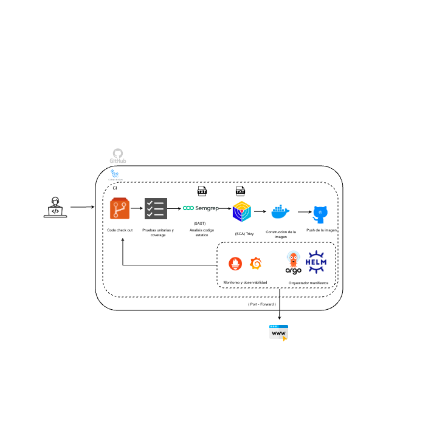

# Proyecto Web-Test: Pipeline DevSecOps y GitOps

Este repositorio contiene una solución de entrega continua para una aplicación Python (FastAPI). Integra prácticas de seguridad, despliegue automatizado en Kubernetes mediante ArgoCD y un stack de Observabilidad.

## Tecnologías Utilizadas

- Lenguaje: Python (FastAPI)
- CI/CD: GitHub Actions
- Seguridad (SAST): Semgrep
- Infraestructura: Kubernetes (Kind) y Helm
- GitOps: ArgoCD
- Observabilidad: Prometheus y Grafana

---

## 1. Arquitectura del Flujo End-to-End



El flujo de trabajo sigue un modelo de automatización total:

- Integración Continua (CI): Al realizar un push, GitHub Actions ejecuta el escaneo de código con Semgrep para detectar vulnerabilidades de seguridad.
- Construcción y Seguridad: Se genera la imagen Docker y se sube al registro de contenedores.
- Disparador GitOps: El pipeline actualiza automáticamente el tag de la imagen en el archivo `charts/my-app/values.yaml`.
- Despliegue Continuo (CD): ArgoCD detecta el cambio en el repositorio y sincroniza el estado del clúster local (Kind), desplegando la nueva versión de forma automática.

---


## 2. Implementación de Seguridad (DevSecOps)

Se aplicó el principio de "Least Privilege" y el endurecimiento (hardening) de contenedores basado en los hallazgos de Semgrep:

- Sistema de archivos de solo lectura: Configuración de `readOnlyRootFilesystem: true` para mitigar ataques de persistencia y modificación de binarios en caliente.
- Ejecución sin privilegios: Los contenedores se configuran para correr como usuarios no-root mediante la directiva `runAsNonRoot: true`.
- Análisis Automático: El pipeline está configurado para bloquear cualquier commit que no cumpla con las reglas de seguridad de Kubernetes.

---

## 3. Observabilidad y Monitoreo

Se implementó el stack Prometheus-Grafana para obtener visibilidad total del sistema:

- Logs Estructurados: La aplicación emite logs en formato JSON para facilitar su recolección y análisis automatizado.
- Métricas de Aplicación: Se habilitó el endpoint `/metrics` para que Prometheus recolecte datos de rendimiento, latencia y errores.
- Visualización: Se utilizan tableros automáticos en Grafana para monitorear la disponibilidad del API Server y el uso de recursos (CPU y Memoria) de los pods.

---

## 4. Instrucciones de Despliegue

Siga estos pasos para replicar el entorno de manera local:

### Requisitos Previos

- Docker Desktop instalado y en ejecución.
- Kind (Kubernetes in Docker).
- Helm v3 y kubectl configurados.

### Paso 1: Preparación del Clúster

Cree el clúster local utilizando Kind:
```bash
kind create cluster --name devops-project
```

### Paso 2: Instalación del Stack de Monitoreo

Utilice Helm para desplegar Prometheus y Grafana:
```bash
helm repo add prometheus-community https://prometheus-community.github.io/helm-charts
helm repo update
helm install monitoring prometheus-community/kube-prometheus-stack
```


### Paso 3: Acceso a las Herramientas

- Aplicación:
```bash
kubectl port-forward deployment/mi-app 8000:8000
```
- Grafana:
```bash
kubectl port-forward svc/monitoring-grafana 3000:80
```
Usuario: `admin`

---

## 4. Resultados del Estado Actual

- Disponibilidad: 2 réplicas en ejecución constante bajo un esquema de alta disponibilidad.
- Estabilidad: Los pods principales mantienen 0 reinicios tras periodos extensos de prueba.
- Seguridad: El pipeline de CI finaliza con éxito y sin hallazgos críticos de seguridad tras las correcciones aplicadas.
